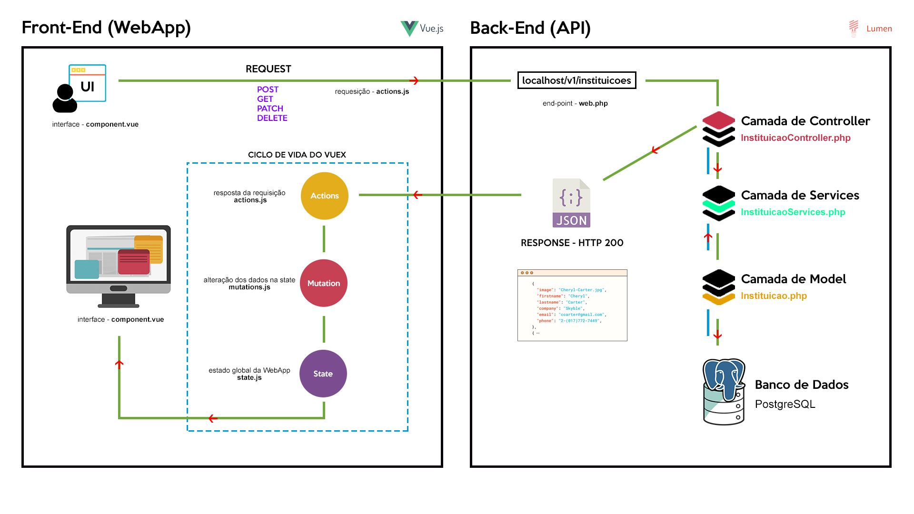
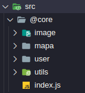
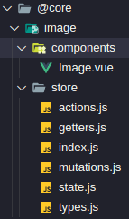
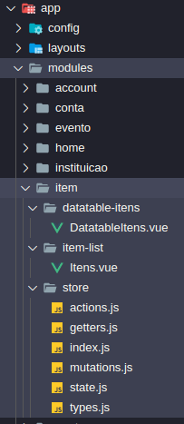
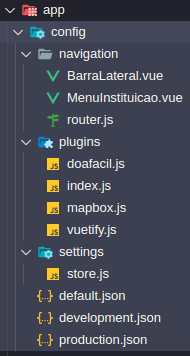
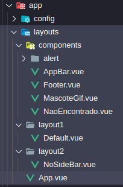
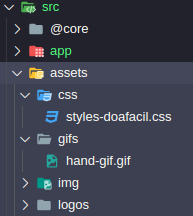

<p align="center">
  
</p>

## Sumary (Sumário)

- [Previews's](#)
- [Como Instalar e usar](#how-to-install-and-use-como-instalar-e-usar)
- [Fluxo da Aplicação](#fluxo-da-aplicacao)
- [Estrutura de Diretórios WebApp](#)
- [Como nomear arquivos na API](#how-to-name-your-file-in-api-como-nomear-arquivos-na-api)
- [Como nomear end-points REST](#how-to-name-end-point-rest-como-nomear-end-points-rest)
- [Como nomear métodos na API](#how-to-name-methods-in-api)
- [Como nomear FK em tabelas](#how-name-structure-table-foreign-key-como-nomear-fk-de-tabelas)
- [Modelagem do Banco de Dados](#)

<hr>

## How to install and use (Como Instalar e usar)

1. Copiar e colar `docker-compose.exemplo` para `docker-compose.yml`

2. Descomente as seguintes linhas:

   ```
   sh -c 'npm i && npm run serve'
   - UPDATE_COMPOSER_DEPENDENCIES=true
   ```

3. Comente a linha

   ```
   sh -c 'npm run serve'
   ```

4. Execute o comando `docker-compose up`

5. Aguarde ate terminar de criar os container e configura-los \*_(Isso levara muito tempo)_

6. Logo apos de finalizar iremos derrubar os container com `Ctrl+c`

7. Comente as linhas:

   ```
   sh -c 'npm i && npm run serve'
   - UPDATE_COMPOSER_DEPENDENCIES=true
   ```

8. Descomente a linha

   ```
   sh -c 'npm run serve'
   ```

9. Pronto, basta executar o comando `docker-compose up` para subir todos os containers

10. Agora temos que terminar algumas configuracoes do JWT e da APP_KEY da API

11. Na pasta **webapp** iremos copiar o arquivo `.example_env` para `.env`

12. Na pasta **api** o arquivo `.env` esta com o campo `APP_KEY=` vazio. Iremos entrar dentro do container para gerar uma chave para o projeto.

13. Execute os seguintes comandos

    ```
    docker exec -it app-api /bin/bash
    php artisan key:generate
    ```

14. Logo apos de finalizar iremos derrubar os container com `Ctrl+c` e subi-los novamente

15. `docker-compose up`

16. Pronto agora o projeto ja esta configurado e pronto para ser desenvolvido novas funcionalidades

---

## Fluxo da Apliacação



O Fluxo da aplicação é dividido entre front-end e back-end. Ao primeiro momento o usuário interage com uma interface gráfica onde internamente é um representado por **arquivo.vue**. Logo após o usuário interagir é disparado uma requisição HTTP, podendo ser dos métodos **(POST, GET, PATCH e DELETE)** através de um arquivo chamado **actions.js**. O disparo da requisição tem um alvo de destino, que no contexto é um _end-point_ da API da aplicação através de um arquivo chamado **web.php**. A requisição é direcionada para a controller em questão do recursos solicitado onde é tratada e realizada o direcionamento para a **camada de serviço**, passando pela **camada de modelo** e **acessando os recursos na base de dados**. Ao obter os dados solicitados é retornado à camada de controle e realizado a resposta a **requisição** no formato de **JSON**. Após a resposta chegar ao cliente HTTP disparado pelo arquivo **actions.js**, os dados percorrem pelo ciclo de vida do **vuex**, seguindo a ordem dos arquivos **actions.js, mutations.js** e **state.js**. Com os com os dados já disponíveis na state, a interface sofre atualizações dispondo a informação solicitado pelo usuário.

A relação a seguinte contém uma discriminação da responsabilidade de cada arquivo do fluxo da aplicação.

- **component.vue**
  Implementação de um interface gráfica do qual o usuário irá interagir.

- **actions.js**
  Implementado a chamada HTTP ao end-point de nosso API interna.

- **web.php**
  Declarados as rotas (end-points) da nossa API utilizando as boas práticas REST.

- **InstituicaoController.php**
  Responsável por fazer as chamadas das funções internas da API para garantindo uma resposta ao cliente.

- **InstituicaoServices.php**
  Implementado todo e qualquer tipo de regra de negócio, disparo e e-mails, tratamento de exceção, verificação, cálculo ou execução de funções interna com o objetivo de entregar o recursos solicitado.
- **Instituicao.php**
  Representa a nossa entidade tabela na base de dados, responsável por realizar as nossas consultas. Nela será implementada toda que qualquer função de operação que for necessário a manipulação de dados.

- **mutations.js**
  Responsável por realizar a atualização da state na WebApp de forma segura e correta respeitando as boas práticas da implementação da arquitetura Flex.

- **state.js**
  Representa o estado global da nossa aplicação, nela ficará armazenado todos os dados do estado global da WebApp no período de execução.

---

## Estrutura de Diretórios WebApp

**Core**

O core module deve **conter serviços singleton**, componentes universais não utilizando regras do negócio que são utilizado pela toda aplicação, recursos que utiliza uma única instância. Autenticação, interceptors, Alerts são exemplos de serviços que terá apenas uma instância ativa para a aplicação e será utilizado praticamente por todos os modules.

<p align="center">
   
</p>

**Modules**

São conjunto de pasta que representa cada caso de uso do projeto, nesta pasta devem ter seus respectivos **contexto da regra do negócio** existe arquivos necessário para a criação da funcionalidade.

**Cada pasta deve ser independente dos outros modules caso haja necessidade da remoção** para outra aplicação seus desligamento tem que ser simples.

Quando utilizamos **modules podemos dividir em duas categorias**:

- helper module (Módulo auxiliar)
- feature module (Módulo de recurso)

**Módulo auxiliar (helper module)**

- Esse tipo de Módulo e deve ser implementado **dentro da pasta core**.
- Um módulo contém vários componentes e diretrizes.
- Potencialmente, esses componentes e diretivas podem ser usados ​​fora do contexto da aplicação seguido a regra de negócio.
- Geralmente, a maioria dos componentes / diretivas é exportada.
- Os componentes exportados geralmente estão de alguma forma relacionados entre si, mas podem ser usados ​​independentemente, portanto, cada um deles tem seu próprio CSS com escopo.

<p align="center">
   
</p>

**Módulo de recursos (feature module)**

- Esse tipo de Módulo deve ser implementado **dentro da pasta app.**
- **Representa um caso de uso**, podendo ter um crud (create, read, update e delete).
- O módulo deve ter um componente principal um vez chamado todos seus sub componentes necessários internamente deve ser carregado automaticamente.
- É provável que o componente não possa ser reutilizado fora do contexto da aplicação.

<p align="center">
   
</p>

**Config**

Um diretório responsável para por centralizar todas **configuração** da aplicação, **navegação, estado, plugins e rotas.**

<p align="center">
   
</p>

**Layout**

Encontra-se dois tipo de layout **um para site público e outro para usuário logado**, cada layout contém seus respectivos componente, podendo utilizar componentes compartilhado que é encontrado na mesma, nesse diretório é utilizando maiores dos componentes designer system do negócio.

<p align="center">
   
</p>

**Services**

Nela deverá ser contida todas as **configurações de serviços e clientes HTTP** que serão utilizados para o consumo de uma API externa ou interna. Ex: serviço de geolocation da google.

<p align="center">
   
</p>

**Assets**

Neste diretórios encontra-se todos os **arquivos estáticos** que serão utilizados na WebApp tais como **css, images, gifs, mídias** e etc

<p align="center">
   
</p>

---

## How to name your file in API (Como nomear arquivos na API)

**Name File Styles**

CamelCase

**Models**

❌ Objeto_Image (BAD)<br>
✅ ObjetoImage (GOOD)

**Services**

❌ Objeto_Image_Services (BAD)<br>
✅ ObjetoImageServices (GOOD)

**Controllers**

❌ Objeto_Image_Controller (BAD)<br>
✅ ObjetoImageController (GOOD)

Valid for (Models, Services, Controlllers)

---

## How to name end-point REST (Como nomear end-points REST)

**Resource Evento**

✅ **GET** `/insituicoes`<br>
✅ **POST** `/insituicoes`<br>
✅ **GET (SHOW)** `/insituicoes/{id}`<br>
✅ **PATCH** `/insituicoes/{id}`<br>
✅ **DELETE** `/insituicoes/{id}`<br>

**Resource with Relationships**

✅ **GET (SHOW)** `/inistituicao/{id}/eventos`

**Group Routes [REQUIRED]**

```php
$router->group(['namespace' => 'Instituicao'], function () use ($router) {
        $router->get('/instituicoes', 'InstituicaoController@get');
        $router->get('/instituicoes/{id}', 'InstituicaoController@get');
        $router->get('/instituicoes/{id}/eventos', 'Evento/EventoController@getEventosByInsti');
        $router->post('/instituicoes', 'InstituicaoController@post');
        $router->patch('/instituicoes/{id}', 'InstituicaoController@patch');
        $router->delete('/instituicoes/{id}', 'InstituicaoController@delete');
    });
```

## How to name methods in API

**Controller**

public function `get`<br>
public function `post`<br>
public function `show`<br>
public function `patch`<br>
public function `delete`<br>

---

**Services**

public static function `get`<br>
public static function `post`<br>
public static function `show`<br>
public static function `patch`<br>
public static function `delete`<br>

---

**Model**

If necessary create basic methods CRUD

public static function `get`<br>
public static function `post`<br>
public static function `show`<br>
public static function `patch`<br>
public static function `delete`<br>

---

**With Another Resource**
CamelCase with **by**

public function `getEventosByInsti`

## How name structure table FOREIGN KEY (Como nomear FK de tabelas)

**FOREIGN KEY**

**usuario_id**

```php
$table->unsignedBigInteger('usuario_id');
            $table->foreign('usuario_id')
                ->references('usuario_id')->on('app.usuario');
```

---

<p align="center">
  
</p>
